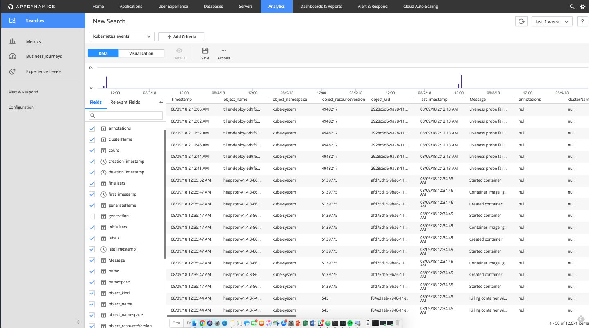

# Setting up config and building Machine Agent DaemonSet from Dockerfile

Once that you have verified your installation of kubernetes, the next step is to
deploy an app to that cluster. To download the source code needed, clone this specific branch with

```
git clone https://github.com/Appdynamics/AD-Capital-Kube.git
```

Ensure that the correct files were downloaded. You should see a a few folders, but the most important
is that the Kubernetes folder is there. All of the Appdynamics agent configuration variables need to be set in the
env-configmap.yaml. Fill in your controller variables in that file. Once you have done that you need to put in the customer name and accesskey in your secret.yaml file. These values need to be base64 encoded. At the terminal type
```
echo -n <yournumberhere> | base64
```

That command will give you the base64 encoded version of your value. Those agent variables are being consumed in the deployments for approval, rest, processor, portal, verification and the daemon set monitor.

The other thing that is important here, is that if you want to include the Kubernetes events extension in the DaemonSet, you are going to need to build the MA yourself. The image below shows the data that the extension pulls in. To do this, just go to the Agent-Dynamic-Loading/appd-machine folder. From there the only things you need to set are the config file, which is your kubectl config for accessing the cluster (extension needs this). The second config file you need to fill out, is in the KubernetesEventsMonitor folder. In that config file you need to set the kubeClientConfig, which is the path to your config file. The other configs you need to set are your eventsApiKey (Global Account Name obtained from AppDynamics --> Settings --> License --> Accounts --> Global Account Name), and your accountName (custom analytics event schema).



Once you have set up all the config. It's a simple
```
docker build -t <yourRepoHere>:<yourTag> .
```

Once you've done that make sure you change the image on monitor-deployment.yaml to match the image you just built.

# Deploying the app

To see how to deploy just click [here](https://github.com/Appdynamics/AD-Capital-Kube/blob/master/Kubernetes-Walkthrough/3.md)
