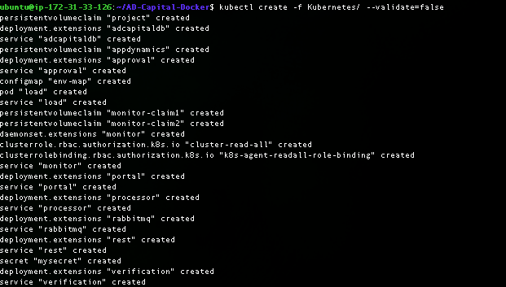
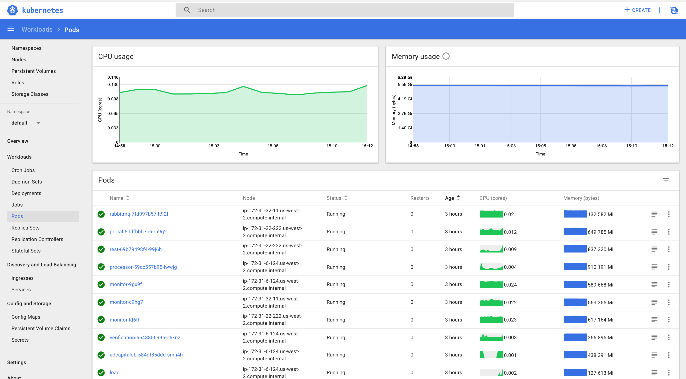
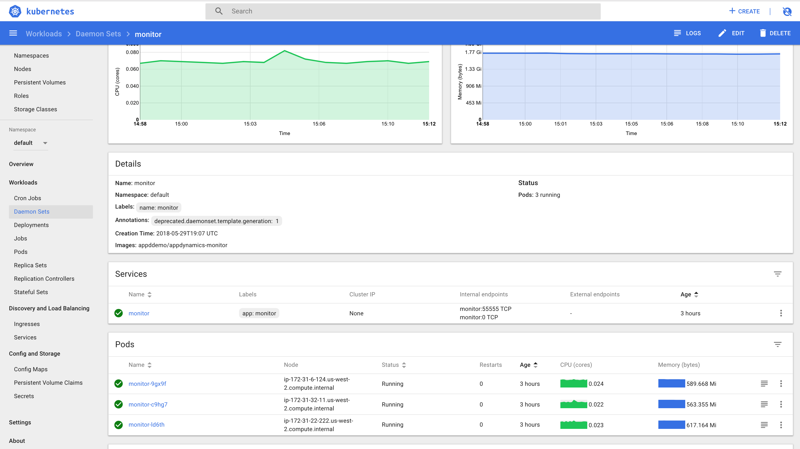
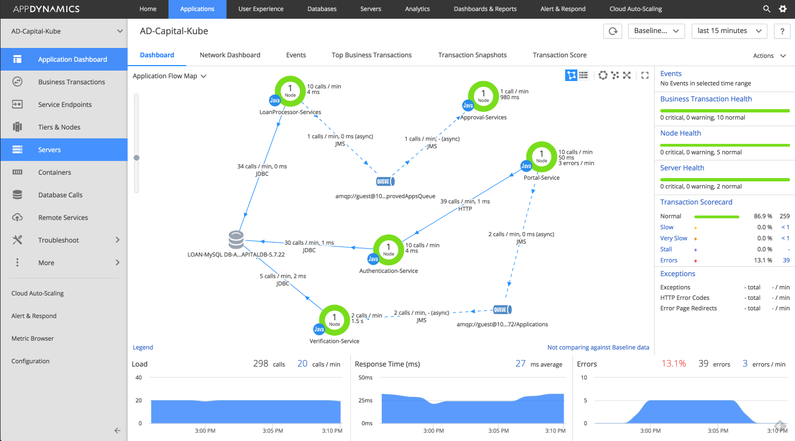
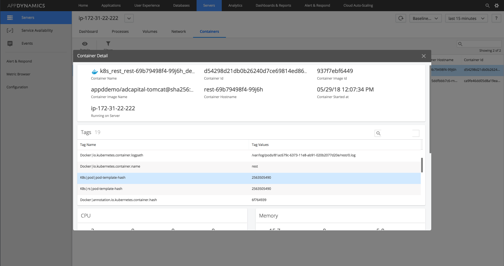

# Deploying to Kubernetes

Deploying is extremely easy. Just run the command below (make sure kubectl is talking to your cluster)

```
kubectl create -f Kubernetes/
```

In return you should be able to see all of the individual pods, deployments, services etc create like below.

To deploy the machine agent just run this command

```
kubectl create -f KubernetesMachineAgent/
```



You should then be able to validate everything via the Kubernetes UI Dashboard and the appdynamics product. If you haven't set up transaction analytics for this application.


See [here](https://github.com/Appdynamics/AD-Capital-Docker/blob/master/ADCapital-Walkthrough/5.md) for steps on how to configure transaction analytics for this application.









# Setting up transaction analytics

To see how to set up transaction analytics just click  [here](https://github.com/Appdynamics/AD-Capital-Kube/blob/master/Kubernetes-Walkthrough/4.md)
